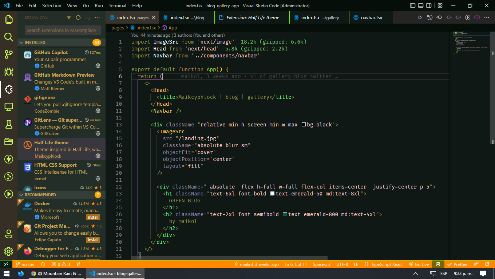

# Half Life Theme

this is a vscode theme inspired by one of the games I played as a kid and I used its main colors to translate it in my favorite editor
## thumbnail

## logo

## color palette

**Enjoy!**
